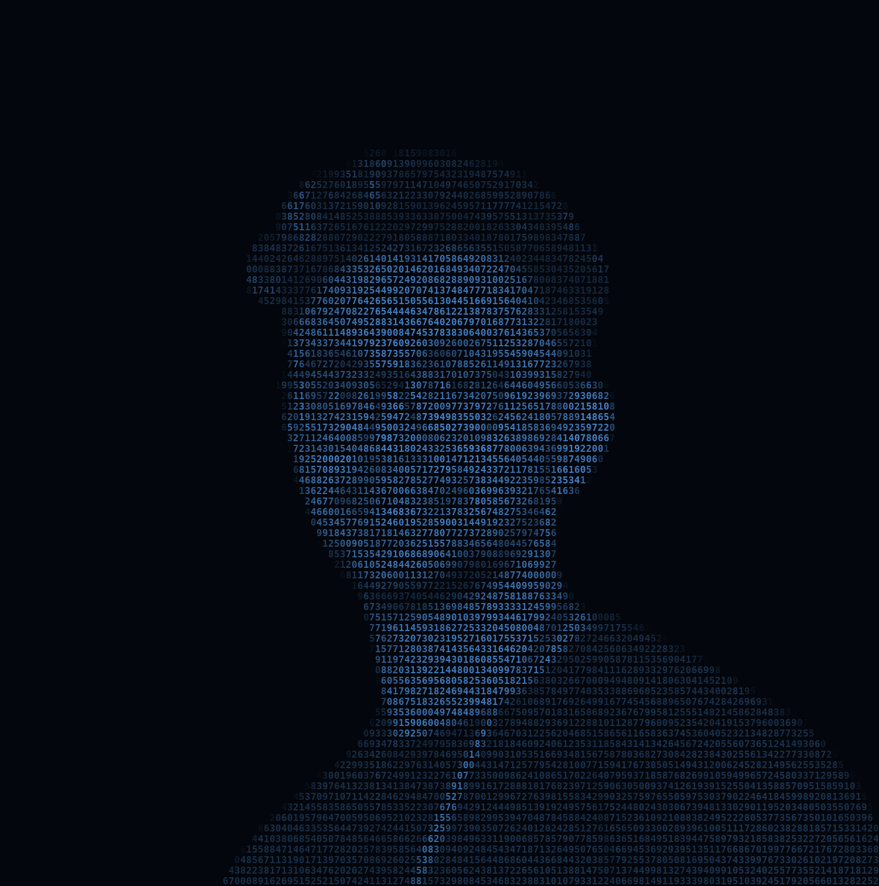

<!-- ╔══════════════════════════════════════════════════════════════════════════╗ -->
<!-- ║                          ANIMATED HEADER BANNER                          ║ -->
<!-- ╚══════════════════════════════════════════════════════════════════════════╝ -->

<a href="https://github.com/DPHeshanRanasinghe">
  
</a>

<!-- ╔══════════════════════════════════════════════════════════════════════════╗ -->
<!-- ║                        NUMBER-ART PORTRAIT                               ║ -->
<!-- ╚══════════════════════════════════════════════════════════════════════════╝ -->

<div align="center">
  
</div>

<!-- ╔══════════════════════════════════════════════════════════════════════════╗ -->
<!-- ║                        TYPING SVG (DYNAMIC INTRO)                        ║ -->
<!-- ╚══════════════════════════════════════════════════════════════════════════╝ -->

<div align="center">
  <a href="https://github.com/DPHeshanRanasinghe">
    
  </a>
</div>

<br/>

<!-- ╔══════════════════════════════════════════════════════════════════════════╗ -->
<!-- ║                        BADGES + PROFILE COUNTER                          ║ -->
<!-- ╚══════════════════════════════════════════════════════════════════════════╝ -->

<p align="center">
  <a href="https://github.com/DPHeshanRanasinghe">
    
  </a>
  <a href="https://github.com/DPHeshanRanasinghe?tab=followers">
    
  </a>
  <a href="https://github.com/DPHeshanRanasinghe?tab=repositories">
    
  </a>
  
</p>

<p align="center">
  <a href="https://www.linkedin.com/in/heshan-ranasinghe-988b00290">
    
  </a>
  <a href="mailto:hranasinghe505@gmail.com">
    
  </a>
  <a href="https://github.com/DPHeshanRanasinghe">
    
  </a>
</p>

<!-- Animated divider -->


<!-- ╔══════════════════════════════════════════════════════════════════════════╗ -->
<!-- ║                              ABOUT ME                                    ║ -->
<!-- ╚══════════════════════════════════════════════════════════════════════════╝ -->

##  &nbsp;About Me

<table>
<tr>
<td width="62%" valign="top">

```yaml
name:        Heshan Ranasinghe
role:        Engineering Undergraduate
university:  University of Moratuwa, Sri Lanka
department:  Electronic & Telecommunication Engineering
location:    Negombo, LK

focus:
  - Computer Vision
  - Biomedical AI
  - NLP / Transformers
  - Quantitative ML
  - FPGA & Edge Acceleration

mindset:
  - HDL on FPGAs → Transformers in PyTorch
  - Research depth + production deployment
  - Open to collaborations & research roles
```

</td>
<td width="38%" align="center" valign="middle">
  
</td>
</tr>
</table>

<!-- Animated divider -->


<!-- ╔══════════════════════════════════════════════════════════════════════════╗ -->
<!-- ║                          RESEARCH DOMAINS                                ║ -->
<!-- ╚══════════════════════════════════════════════════════════════════════════╝ -->

##  &nbsp;Research Domains

<table>
<tr>
<td width="50%" valign="top">

### 🧠 &nbsp;Computer Vision
- **Detection & Segmentation** — YOLO, Mask R-CNN, SAM
- **Representation Learning** — ViT, CLIP, contrastive pretraining
- **FPGA Acceleration** — HDL pipelines, real-time edge inference

`PyTorch` `OpenCV` `ONNX` `Verilog` `Vivado`

</td>
<td width="50%" valign="top">

### 🩻 &nbsp;Biomedical AI
- **3D Brain Tumor Segmentation** — multi-modal MRI ensemble, per-voxel uncertainty, XAI heatmaps
- **Medical Imaging** — retinopathy grading (APTOS 2019)
- **Wearable Systems** — embedded physiological inference

`PyTorch` `MONAI` `SimpleITK` `YOLOv8` `RPi 5`

</td>
</tr>
<tr>
<td width="50%" valign="top">

### 💬 &nbsp;NLP & Transformers
- **Sequence Modeling** — attention, encoder–decoder
- **Multimodal** — image captioning (Flickr8k / MS-COCO)
- **LLM Fine-tuning** — task-specific, parameter-efficient

`HuggingFace` `Transformers` `PyTorch`

</td>
<td width="50%" valign="top">

### 📈 &nbsp;Financial ML
- **Time-Series Forecasting** — crypto, LSTM/Transformer hybrids
- **Quantitative Strategies** — anomaly detection, signal extraction

`Pandas` `NumPy` `PyTorch`

</td>
</tr>
</table>

<!-- Animated divider -->


<!-- ╔══════════════════════════════════════════════════════════════════════════╗ -->
<!-- ║                          SELECTED PROJECTS                               ║ -->
<!-- ╚══════════════════════════════════════════════════════════════════════════╝ -->

##  &nbsp;Selected Projects

<table>
<thead>
<tr>
  <th align="left">Project</th>
  <th align="left">Domain</th>
  <th align="left">Stack</th>
</tr>
</thead>
<tbody>
<tr>
  <td><strong>🧠 CranioVision</strong><br/><sub>AI-assisted clinical platform — 3D brain tumor segmentation with multi-model consensus, per-voxel uncertainty quantification, XAI attention heatmaps, and volumetric analysis from multi-modal MRI (T1, T1c, T2, FLAIR).</sub></td>
  <td>Biomedical AI · CV</td>
  <td><code>PyTorch</code> <code>MONAI</code> <code>SimpleITK</code></td>
</tr>
<tr>
  <td><strong>⚡ Task-Driven Detection + FPGA</strong><br/><sub>DVcon India 2026 — HDL acceleration pipeline for YOLO-based detection on Xilinx FPGAs.</sub></td>
  <td>Computer Vision · Edge AI</td>
  <td><code>Verilog</code> <code>Vivado</code> <code>YOLOv8</code></td>
</tr>
<tr>
  <td><strong>🤖 Autonomous Cleaning Robot</strong><br/><sub>EN2160 — ROS2 navigation stack with real-time vision and SLAM.</sub></td>
  <td>Robotics · CV</td>
  <td><code>RPLIDAR</code> <code>ROS2</code> <code>YOLOv8</code> <code>RPi 5</code></td>
</tr>
<tr>
  <td><strong>👁️ Eye Disease Grading</strong><br/><sub>Diabetic retinopathy classification on APTOS 2019 — EfficientNet-B4, progressive unfreezing, 3-fold CV, TTA. Best QWK ≈ 0.934.</sub></td>
  <td>Medical Imaging</td>
  <td><code>PyTorch</code> <code>ONNX</code></td>
</tr>
<tr>
  <td><strong>🖼️ Image Captioning</strong><br/><sub>CNN encoder + Transformer decoder, Flickr8k / MS-COCO.</sub></td>
  <td>Multimodal NLP</td>
  <td><code>PyTorch</code> <code>HuggingFace</code></td>
</tr>
</tbody>
</table>

<!-- Animated divider -->


<!-- ╔══════════════════════════════════════════════════════════════════════════╗ -->
<!-- ║                              TECH STACK                                  ║ -->
<!-- ╚══════════════════════════════════════════════════════════════════════════╝ -->
##  &nbsp;Tech Stack
<div align="center">

**Languages**

<br/>


<br/><br/>

**Machine Learning / AI**

<br/>


<br/><br/>

**Hardware · Embedded · Robotics**

<br/>


<br/><br/>

**Tools**

</div>

<!-- Animated divider -->


<!-- ╔══════════════════════════════════════════════════════════════════════════╗ -->
<!-- ║                          GITHUB STATISTICS                               ║ -->
<!-- ╚══════════════════════════════════════════════════════════════════════════╝ -->

##  &nbsp;GitHub Statistics

<div align="center">
  
  
</div>

<br/>

<div align="center">
  
  
</div>

<br/>

<div align="center">
  
  
</div>

<br/>

<!-- Contribution activity graph -->
<div align="center">
  
</div>

<br/>

<!-- Trophies -->
<div align="center">
  <a href="https://github.com/DPHeshanRanasinghe">
    
  </a>
</div>

<!-- Animated divider -->


<!-- ╔══════════════════════════════════════════════════════════════════════════╗ -->
<!-- ║                          SNAKE ANIMATION                                 ║ -->
<!-- ╚══════════════════════════════════════════════════════════════════════════╝ -->

##  &nbsp;Contribution Snake

<div align="center">
  <picture>
    <source media="(prefers-color-scheme: dark)" srcset="https://raw.githubusercontent.com/DPHeshanRanasinghe/DPHeshanRanasinghe/output/github-contribution-grid-snake-dark.svg" />
    <source media="(prefers-color-scheme: light)" srcset="https://raw.githubusercontent.com/DPHeshanRanasinghe/DPHeshanRanasinghe/output/github-contribution-grid-snake.svg" />
    
  </picture>
</div>

<!-- Animated divider -->


<!-- ╔══════════════════════════════════════════════════════════════════════════╗ -->
<!-- ║                             COMMUNITY                                    ║ -->
<!-- ╚══════════════════════════════════════════════════════════════════════════╝ -->

##  &nbsp;Community & Leadership

- 🎤 **Event Chair** — IEEE Signal Processing Society Student Branch Chapter · *SP Cup (inaugural)* · University of Moratuwa
- 💰 **Finance Committee Coordinator** — *AI Driven Srl Lanka*, IEEE Sri Lanka Section

<!-- Animated divider -->


<!-- ╔══════════════════════════════════════════════════════════════════════════╗ -->
<!-- ║                            QUOTE OF THE DAY                              ║ -->
<!-- ╚══════════════════════════════════════════════════════════════════════════╝ -->

##  &nbsp;Today's Reflection

<div align="center">
  
</div>

<!-- ╔══════════════════════════════════════════════════════════════════════════╗ -->
<!-- ║                            CONNECT FOOTER                                ║ -->
<!-- ╚══════════════════════════════════════════════════════════════════════════╝ -->

<br/>

<div align="center">

### 🌐 &nbsp;Let's Connect

<em>Open to collaborations in computer vision, biomedical AI, NLP, and quantitative ML.</em>

<br/>

<a href="https://www.linkedin.com/in/heshan-ranasinghe-988b00290">
  
</a>
<a href="mailto:hranasinghe505@gmail.com">
  
</a>
<a href="https://github.com/DPHeshanRanasinghe">
  
</a>

</div>

<br/>


<!-- ╔══════════════════════════════════════════════════════════════════════════╗ -->
<!-- ║                                                                          ║ -->
<!-- ║  SETUP NOTE: To enable the contribution snake animation, create the file ║ -->
<!-- ║  .github/workflows/snake.yml in the special repo named                   ║ -->
<!-- ║  DPHeshanRanasinghe/DPHeshanRanasinghe — instructions below in README.   ║ -->
<!-- ║                                                                          ║ -->
<!-- ╚══════════════════════════════════════════════════════════════════════════╝ -->
